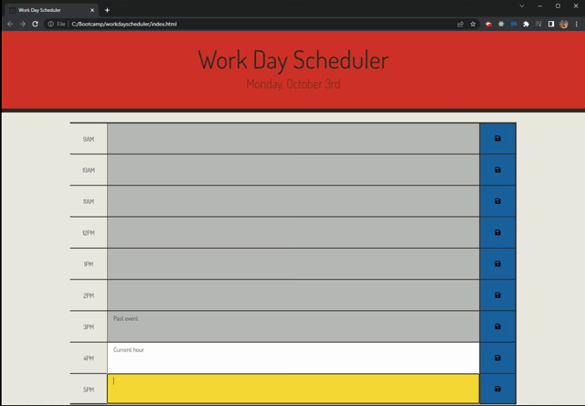

# Workday Scheduler 📅

A simple calendar application that allows a user to save events for each hour of the day. This app runs in the browser and features dynamically updated HTML and CSS powered by jQuery.

## Built With

## Demo

## Link 

[Workday Scheduler](https://chloeharris1.github.io/workdayscheduler/)

## License
Licensed under the MIT license.

## Questions 
[Email Me](Chloe.a.harris17@gmail.com) if you have any questions.

Check out more of my work on [GitHub](https://github.com/chloeharris1).
